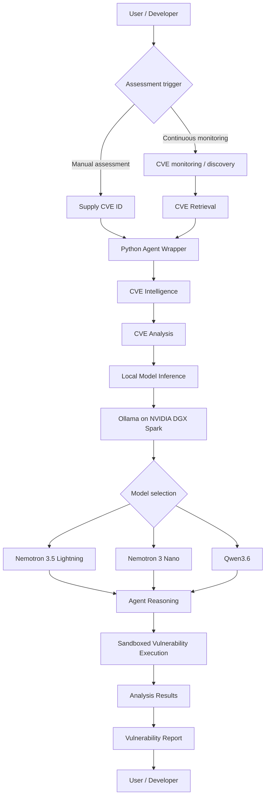

```mermaid
flowchart TD
    A["User / Developer"] --> B{"Assessment trigger"}

    B -->|"Manual assessment"| C["Supply CVE ID"]
    B -->|"Continuous monitoring"| D["CVE monitoring / discovery"]

    C --> E["Python Agent Wrapper"]
    D --> F["CVE Retrieval"]
    F --> E

    E --> G["CVE Intelligence"]
    G --> H["CVE Analysis"]

    H --> I["Local Model Inference"]
    
    I --> J["Ollama on NVIDIA DGX Spark"]
    J --> K{"Model selection"}
    K --> L["Nemotron 3.5 Lightning"]
    K --> M["Nemotron 3 Nano"]
    K --> N["Qwen3.6"]

    L --> O["Agent Reasoning"]
    M --> O
    N --> O

    O --> P["Sandboxed Vulnerability Execution"]
    P --> Q["Analysis Results"]
    Q --> R["Vulnerability Report"]

    R --> S["User / Developer"]
```